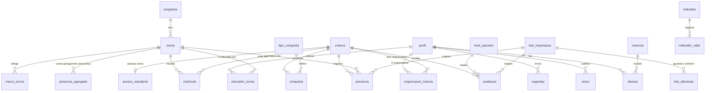

# Modelo de dados — Portal Ebenézer

Banco Postgres no Supabase (região São Paulo). Toda permissão por perfil é imposta pelo banco com Row Level Security, não pela navegação. Os arquivos de origem estão em `supabase/migrations/`.

## Diagrama

## Decisões que o modelo impõe

| Decisão | Como está no banco |
| --- | --- |
| Minimização de dados | Não existe coluna de endereço, documento, renda, saúde, registro clínico ou foto de criança. A criança tem só nome de exibição, ano de nascimento e o código do parceiro. |
| Programas sensíveis (Vivências Terapêuticas) | `programa.sensivel = true`. Um gatilho recusa presença individual; só entra `presenca_agregada` (total por turma e dia). Matrícula nesses programas aparece só para a gestão e o responsável. |
| Consentimento revogável (RF-03) | `responsavel_crianca.consentimento_em` e `consentimento_revogado_em`. Sem consentimento ativo, presença, avaliação e conquistas somem para o responsável, mas o vínculo continua. |
| Acesso da criança liberado pelo responsável (RF-04) | `acesso_estudante.suspenso_em`. Com acesso suspenso, a criança deixa de ver qualquer dado na hora. |
| Valor doado nunca é público (princípio 2) | `doacao` é visível só ao próprio apoiador e à gestão. A visão pública `publico_reconhecimento` não tem coluna de valor: mostra meses de apoio e carências apoiadas, só de quem autorizou. |
| Importação com prévia e desfazer (RF-11) | Função `importar(tipo, arquivo, linhas, confirmar)`. Sem confirmar, devolve a prévia e os erros por linha. Com confirmar, grava tudo ou nada. `desfazer_lote(lote)` restaura o anterior a partir de `lote_alteracao`. |
| Tradução em série escolar (RF-08) | `nivel_parceiro` guarda a escala da Alicerce. A visão `avaliacao_traduzida` já entrega a série equivalente. |
| Conquistas só se acumulam (RF-09) | Geradas por gatilho a cada bloco completo e a cada nível novo de leitura. A primeira avaliação é linha de base e não gera conquista. Não há política de exclusão. |
| Agregados sem reidentificação | Visões `publico_*` suprimem números de grupos com menos de 5 crianças. |
| Ninguém muda o próprio papel | Gatilho em `perfil` recusa troca de papel ou de status por quem não é gestão. |
| Dado desatualizado é estado normal | Visão `painel_atualizacao`: reforço desatualizado após 7 dias sem presença, programas de sábado após 14. |

## Perfis

Os sete perfis da matriz de permissões são o enum `papel` (`responsavel`, `estudante`, `educacao`, `doador_pf`, `empresa`, `gestao`) mais o visitante, que é o acesso anônimo sem perfil.

## Testes de permissão

`supabase/tests/permissoes_test.sql` entra como cada perfil e confere 35 regras: o que cada um vê, o que não vê e o que não consegue fazer. Roda em Postgres local com o stub `tests/00_stub_supabase_local.sql`, que imita o mínimo do Supabase.
